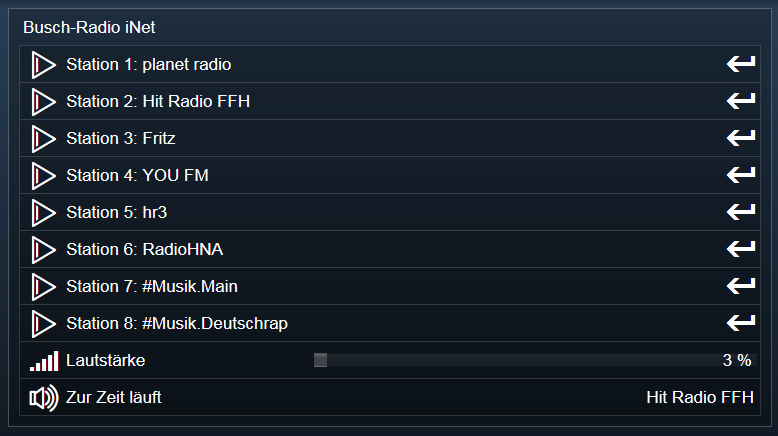
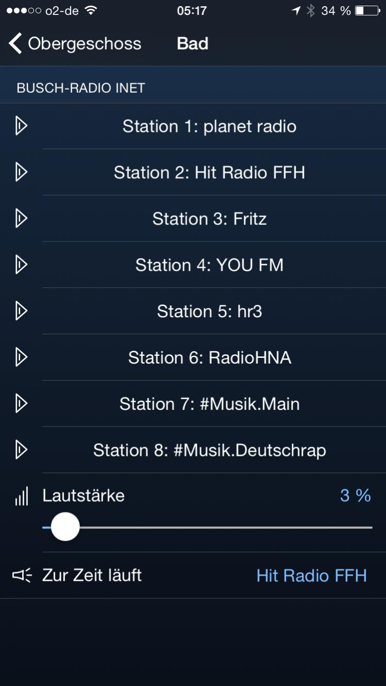

# IPSBusch-Radio-iNet

IP Symcon Skript zur Steuerung vom Busch-Radio iNet.

## [Installation & Update](INSTALL.md)

## [Changelog](CHANGELOG.md)

## Hinweis
Das Radio sollte unter Energieeinstellungen auf "Premium" (oder "Standby") gestellt werden. In der Standardeinstellung "Eco" ist das Radio im ausgeschalteten Zustand nicht mit dem Netzwerk verbunden.

## Screenshots

### Web

### iOS

